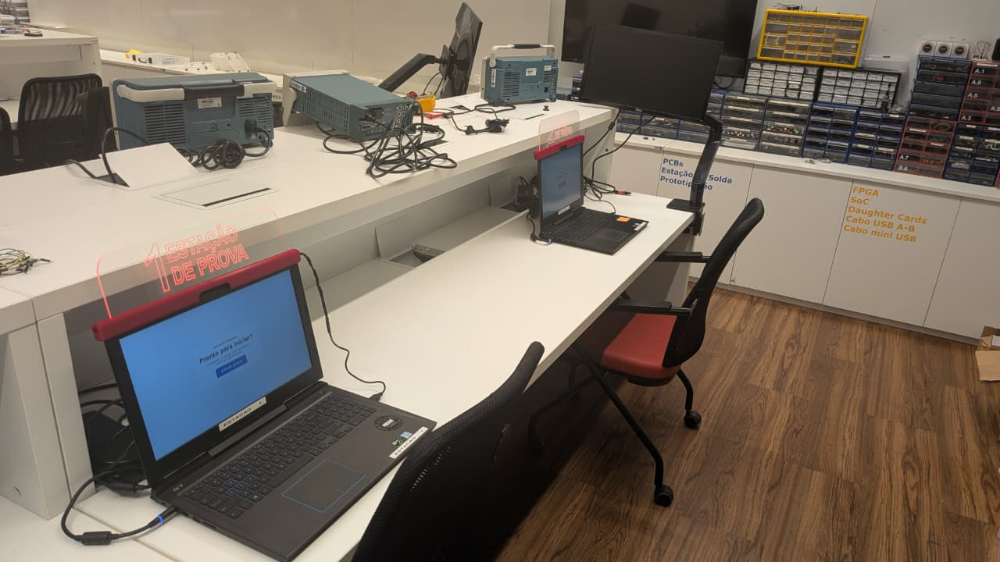
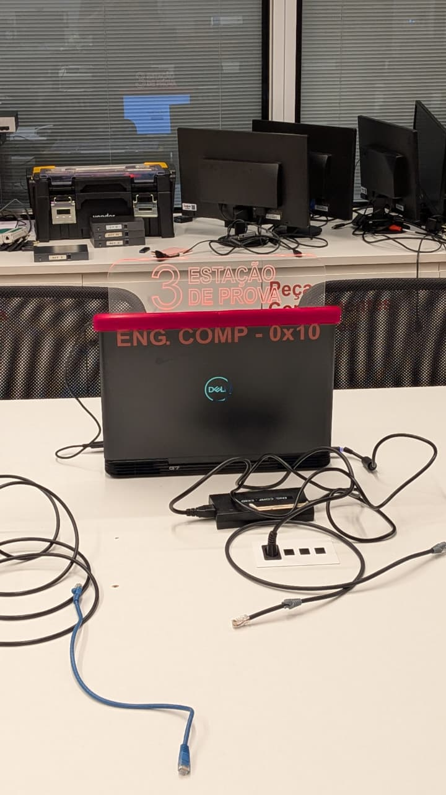
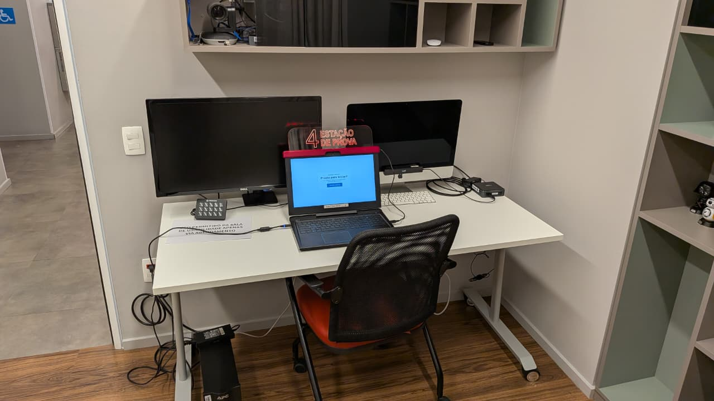

# Estações de Provas

Temos **4 estações de provas** disponíveis:

* **2** em **Arquitetura de Computadores**
* **1** em **Cloud**
* **1** em **Usabilidade**

Conforme ilustrado a seguir:

### Arquitetura de Computadores

### Cloud

### Usabilidade

## Disponibilidade das estações

### Arquitetura de Computadores

| Dia           | Horário    |
| ------------- | ---------- |
| Segunda-feira | 10h às 12h |
| Terça-feira   | 10h às 19h |
| Quarta-feira  | 10h às 20h |
| Quinta-feira  | 10h às 20h |
| Sexta-feira   | 08h às 16h |

### Cloud

| Dia           | Horário    |
| ------------- | ---------- |
| Segunda-feira | 10h às 19h |
| Terça-feira   | 14h às 20h |
| Quarta-feira  | 10h às 20h |
| Quinta-feira  | 10h às 20h |
| Sexta-feira   | 08h às 20h |

### Usabilidade

| Dia           | Horário    |
| ------------- | ---------- |
| Segunda-feira | 13h às 20h |
| Terça-feira   | 13h às 20h |
| Quarta-feira  | 13h às 20h |
| Quinta-feira  | 13h às 20h |
| Sexta-feira   | 13h às 20h |

## Precisa de um lugar mais tranquilo?

A sala de **Usabilidade** oferece um ambiente mais silencioso e pode ser utilizada por quem precisa de um espaço mais tranquilo para realizar a prova.

